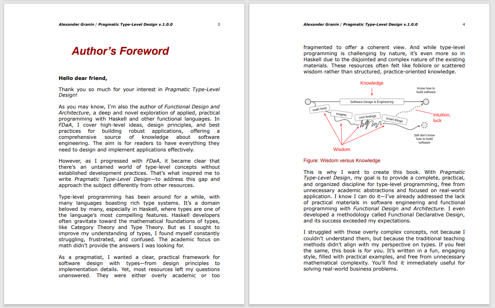
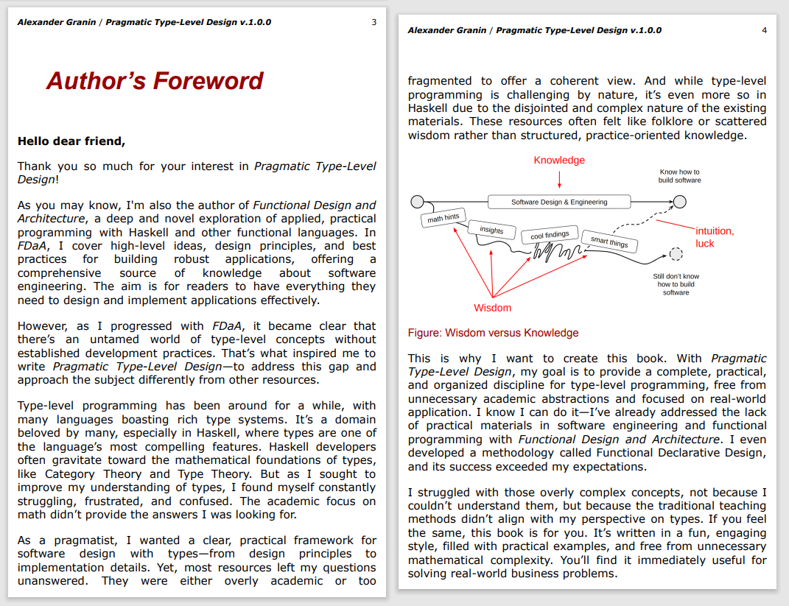

# DimonSmart.PdfCropper

[](https://github.com/DimonSmart/PdfCropper/actions/workflows/build-and-test.yml)
[](https://www.nuget.org/packages/DimonSmart.PdfCropper)
[](https://www.nuget.org/packages/DimonSmart.PdfCropper)
[](LICENSE)
[](https://codecov.io/gh/DimonSmart/PdfCropper)

DimonSmart.PdfCropper is a cross-platform .NET library that intelligently trims PDF pages to actual content using two different methods. The library exposes a simple API through `PdfSmartCropper.CropAsync`, which accepts a PDF document in memory and returns a new PDF with recalculated `CropBox` and `TrimBox` on every non-empty page.

## Platform Support

✅ **Windows** - Full support  
✅ **Linux** - Full support  
✅ **macOS** - Full support  
✅ **Other Unix systems** - Compatible with .NET runtime  

**Target Frameworks**: .NET 6.0, .NET 8.0, .NET 9.0

## Installation

Install the package via NuGet:

```bash
dotnet add package DimonSmart.PdfCropper
```

Or via Package Manager Console:

```
Install-Package DimonSmart.PdfCropper
```

## Example

Here's a visual example of what PdfCropper does - it removes unnecessary margins and whitespace:

| Before Cropping | After Cropping |
|----------------|----------------|
|  |  |

*Example pages from "[Pragmatic Type-Level Design](https://graninas.com/pragmatic-type-level-design-book/)" by Alexander Granin*

The CLI utility is particularly useful for reading e-books with minimal margins, making them more comfortable to read on tablets and e-readers by removing excessive whitespace around the content.

## Features

* **Two cropping methods**:
  - **ContentBased** (default): Analyzes PDF content (text, vectors, images) directly - fast and preserves quality
  - **BitmapBased**: Renders pages to images and analyzes pixels - more accurate for complex layouts
* Preserves the existing content streams, metadata, fonts and resources
* Leaves empty pages untouched and keeps `MediaBox`, `BleedBox` and `ArtBox` intact
* Handles rotated pages and maintains deterministic output
* Extensible logging through `IPdfCropLogger` interface
* Built on top of iText 9.3 and PDFium (for bitmap rendering)

## Usage

### Basic Usage (ContentBased method - default)

```csharp
using DimonSmart.PdfCropper;

byte[] cropped = await PdfSmartCropper.CropAsync(inputBytes, cancellationToken);
```

### Using BitmapBased Method

```csharp
using DimonSmart.PdfCropper;

byte[] cropped = await PdfSmartCropper.CropAsync(
    inputBytes, 
    CropMethod.BitmapBased, 
    logger: null,
    cancellationToken);
```

### With Custom Logger

```csharp
using DimonSmart.PdfCropper;

public class MyLogger : IPdfCropLogger
{
    public void LogInfo(string message) => Console.WriteLine($"[INFO] {message}");
    public void LogWarning(string message) => Console.WriteLine($"[WARN] {message}");
    public void LogError(string message) => Console.Error.WriteLine($"[ERROR] {message}");
}

var logger = new MyLogger();
byte[] cropped = await PdfSmartCropper.CropAsync(
    inputBytes, 
    CropMethod.ContentBased, 
    logger,
    cancellationToken);
```

The method throws `PdfCropException` with a specific `PdfCropErrorCode` when the input is invalid, encrypted or cannot be processed.

### Command Line Utility

The repository includes a console application that wraps the library. This CLI tool is especially useful for preparing e-books and documents for comfortable reading on tablets and e-readers by removing excessive margins and whitespace.

**Perfect for e-book readers**: Transform PDF books with large margins into reader-friendly versions that utilize screen space more efficiently.

```bash
# Basic usage (ContentBased method)
dotnet run --project src/PdfCropper.Cli/PdfCropper.Cli.csproj -- input.pdf output.pdf

# With BitmapBased method
dotnet run --project src/PdfCropper.Cli/PdfCropper.Cli.csproj -- input.pdf output.pdf -m 1

# With verbose logging
dotnet run --project src/PdfCropper.Cli/PdfCropper.Cli.csproj -- input.pdf output.pdf -v

# All options combined
dotnet run --project src/PdfCropper.Cli/PdfCropper.Cli.csproj -- input.pdf output.pdf -m 1 -v
```

#### CLI Options

- `-m, --method <0|1>` - Cropping method:
  - `0` = ContentBased (default, analyzes PDF content)
  - `1` = BitmapBased (renders to image, slower but more accurate)
- `-v, --verbose` - Enable verbose logging

## Cropping Methods Comparison

| Feature | ContentBased | BitmapBased |
|---------|-------------|-------------|
| Speed | ⚡ Fast | 🐌 Slower |
| Quality | ✅ Preserves vector quality | ⚠️ Rasterizes content |
| Accuracy | Good for standard documents | Better for complex layouts |
| Use case | Most PDFs | PDFs with complex graphics |

## Development

* Library target frameworks: `.NET 6.0`, `.NET 8.0`, `.NET 9.0`
* Cross-platform support: Windows, Linux, macOS, and other Unix systems
* Dependencies:
  * iText 9.3.0 (PDF manipulation)
  * PDFtoImage 5.1.1 (PDF to bitmap rendering) - includes native libraries for all platforms
  * SkiaSharp (image processing) - cross-platform 2D graphics
* Tests are located in `tests/PdfCropper.Tests` and use xUnit
* Build with `dotnet build PdfCropper.sln`
* Run tests with `dotnet test PdfCropper.sln`
* CI/CD: Automated builds and tests via GitHub Actions - see [GitHub Actions Setup](GITHUB_ACTIONS.md)

### Platform-Specific Notes

* **Linux**: Requires `libfontconfig1` and `libgdiplus` for optimal PDF rendering
* **macOS**: No additional dependencies required
* **Windows**: No additional dependencies required

## API Reference

### IPdfCropLogger Interface

```csharp
public interface IPdfCropLogger
{
    void LogInfo(string message);
    void LogWarning(string message);
    void LogError(string message);
}
```

### CropMethod Enum

```csharp
public enum CropMethod
{
    ContentBased = 0,  // Analyzes PDF content
    BitmapBased = 1    // Renders to bitmap
}
```

